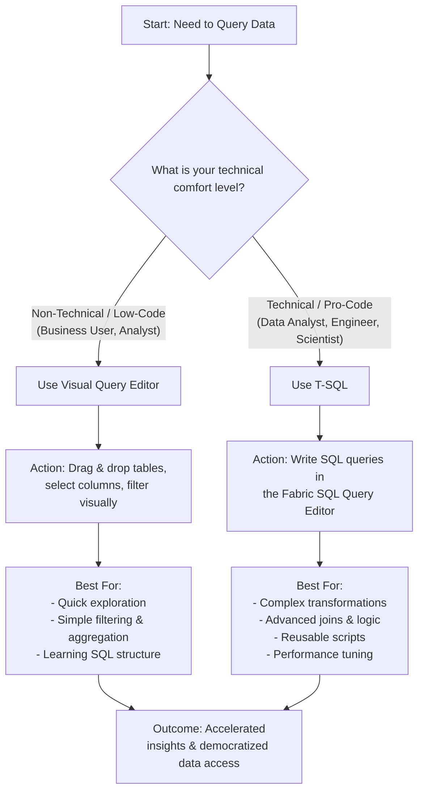

# Mastering Data Warehouse Querying: From Raw Data to Strategic Insights

Learning to query a data warehouse is a superpower. It empowers you to directly interrogate vast stores of information, transforming raw data into meaningful insights that drive strategic decisions, optimize operations, and reveal hidden opportunities. However, there is no single "correct" way to query; the optimal path depends entirely on your specific data structure and the business question you need to answer.

Microsoft Fabric provides a versatile toolkit to accommodate different skillsets and use cases. Your approach can range from fully visual to fully code-based.

### Choosing Your Query Method: A Strategic Approach

The best method for querying your Fabric Warehouse depends on your technical comfort and the complexity of your task. The following flowchart helps you decide the right tool for the job:

> **Tip**: Don't be afraid to mix and match! A highly effective workflow is to use the **Visual Query Editor** to build the foundation of your query (like joins and basic filters) and then switch to the **SQL view** to manually refine the code with more complex logic. This is an excellent way to learn SQL.

### Foundational Steps for Effective Querying

No matter which method you choose, a disciplined approach is key to success:

1.  **Understand the Schema:** Before writing a single line of code or dragging a table, explore the warehouse's tables, columns, and relationships. Use the built-in data preview features to familiarize yourself with the data.
2.  **Define Your Objective:** Clearly articulate the business question. What are you trying to calculate, prove, or discover? A vague question leads to a vague query.
3.  **Iterate and Refine:** Rarely is the first query you write the final one. Start simple, check your results, and gradually add layers of complexity (like `JOINs`, `WHERE` clauses, and `GROUP BY` aggregations).
4.  **Validate Your Results:** Always sanity-check your output. Do the numbers make sense? A small mistake in a `JOIN` condition or filter can lead to wildly incorrect results.

> **Info**: Querying is a skill built through practice. The more you explore your data, the better you will understand its nuances and the more valuable your insights will become. Microsoft Fabric's integrated tools are designed to lower the barrier to entry and support this learning journey.

### Leveraging Microsoft Fabric's Full Potential

Your data warehouse in Fabric is not an isolated island. It is part of a unified SaaS platform that simplifies analytics. The methods you use to query it are designed for seamless integration with the rest of the Fabric ecosystem, enabling you to turn your queries into powerful reports, dashboards, and machine learning models.

For a deep dive into the technical capabilities and connection details, please refer to the official Microsoft documentation:

*   [**Connectivity to data warehousing in Microsoft Fabric**](https://learn.microsoft.com/en-us/fabric/data-warehouse/connectivity) - Understand how different tools and applications can connect to your warehouse.
*   [**Query the SQL analytics endpoint or Warehouse in Microsoft Fabric**](https://learn.microsoft.com/en-us/fabric/data-warehouse/query-warehouse) - A comprehensive guide on the various methods for running queries.
*   [**View data in the Data preview in Microsoft Fabric**](https://learn.microsoft.com/en-us/fabric/data-warehouse/data-preview) - Learn how to quickly explore and sample your data without writing a full query.

By mastering these tools and adopting a strategic approach, you move from simply storing data to actively leveraging it as a strategic asset.
