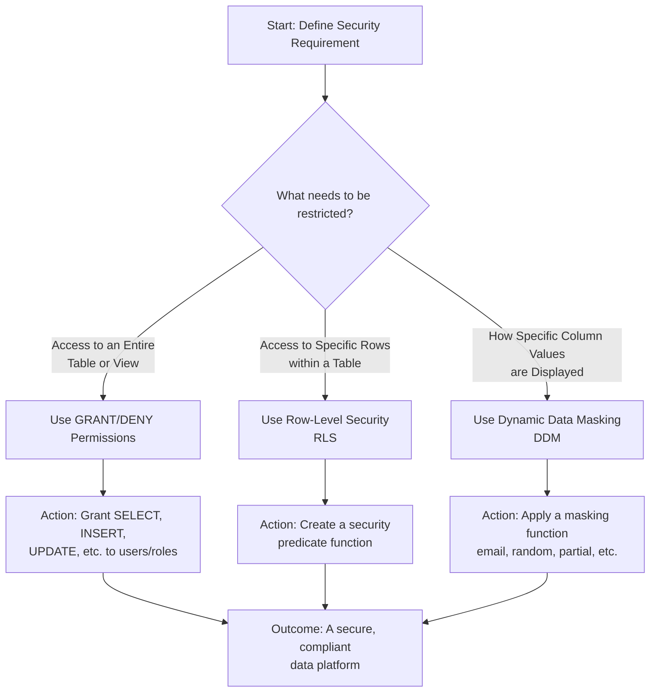

## Securing Your Microsoft Fabric Data Warehouse: A Layered Defense Strategy

Protecting sensitive data is paramount. Microsoft Fabric provides a comprehensive suite of features that work together to implement a robust, layered security model. This module covered the essential tools to achieve this, guided by the core principle of **least privilege**.

The goal is to ensure that users and applications can access *only* the data they *need* to see, and in *only* the form they need to see it.

### The Security Toolbox: Choosing the Right Tool

Each security feature serves a distinct purpose. The following flowchart helps you decide which tool to use for a given requirement:

### Key Takeaways and Strategic Implementation

#### 1. Dynamic Data Masking (DDM): Obscure Data in Real-Time
*   **What it is:** A policy-based feature that hides sensitive data in the results of a query without changing the underlying data.
*   **Best For:** Protecting PII/PCI data (like emails, phone numbers, credit card numbers) in applications where many users need access to a table but shouldn't see all data in its raw form.
*   **Actionable Insight:** Use **partial()** masking for identifiers (e.g., `XXX-XX-1234` for SSN) and **email()** masking for user emails in dashboards or reports for non-privileged users.

#### 2. Row-Level Security (RLS): Filter Data at the Row Level
*   **What it is:** A filter that automatically applies to every query on a table, restricting which rows a user can see based on a security predicate function.
*   **Best For:** Multi-tenant applications, regional data isolation, or ensuring users can only access data related to their department (e.g., a salesperson only sees their own sales).
*   **Actionable Insight:** The security predicate is a simple function that returns `1` (for rows they can see) or `0`. A common pattern is to use `USER_NAME()` or `USER_PRINCIPAL_NAME()` to match a user identity to a row.

#### 3. Column-Level Security (CLS) & Permissions: Control Access to Objects
*   **What it is:** The foundational layer of security. You use standard SQL `GRANT`, `DENY`, and `REVOKE` statements to control who can perform what actions (e.g., `SELECT`, `INSERT`, `ALTER`) on which objects (Warehouses, Tables, Views).
*   **Best For:** Enforcing the principle of least privilege. For example, granting read-only access to analysts, write access to ETL engineers, and full control to administrators.
*   **Actionable Insight:** **Always use roles.** Create SQL roles like `warehouse_reader`, `warehouse_writer`, and `sales_table_analyst`. Assign permissions to the roles, then assign users to the roles. This is far easier to manage than assigning permissions to individual users.

### The Golden Rule: Principle of Least Privilege (PoLP)

This is the guiding philosophy behind all security configurations. It means:
> **"A user or process should have only the minimum levels of access necessary to perform its functions."**

In practice, this means:
*   Don't grant `CONTROL` if `SELECT` is sufficient.
*   Don't grant `SELECT` on the entire warehouse if a user only needs access to two views.
*   Use `DENY` sparingly but decisively to create explicit blocks that override broader `GRANT` statements.

### Bringing It All Together: A Practical Example

Imagine a `Customers` table with `CustomerID`, `Name`, `Email`, `Phone`, and `SalesRegion` columns.

*   **Permission Layer (`GRANT`):** You `GRANT SELECT` on the `Customers` table to the `SalesTeam` role.
*   **Row-Level Security (RLS):** You implement an RLS predicate so that a sales manager in the "West" region only sees rows where `SalesRegion = 'West'`.
*   **Dynamic Data Masking (DDM):** You apply `email()` masking to the `Email` column and `partial(3, "XXX-XXX-", 4)` masking to the `Phone` column for the `SalesTeam` role. The regional manager might be in an unmasked group.

The result: A salesperson queries the `Customers` table. They see only customers in their region, and for those customers, the contact information is appropriately masked. The data is protected, and access is compliant.

For detailed implementation guides, please refer to the official Microsoft documentation:

*   [**Create a Warehouse in Microsoft Fabric**](https://learn.microsoft.com/en-us/fabric/data-warehouse/create-warehouse)
*   [**Security for data warehousing in Microsoft Fabric**](https://learn.microsoft.com/en-us/fabric/data-warehouse/security)
*   [**Share your warehouse and manage permissions**](https://learn.microsoft.com/en-us/fabric/data-warehouse/share-warehouse-manage-permissions)

By mastering and combining these tools, you can build a secure, scalable, and compliant data platform in Microsoft Fabric.
