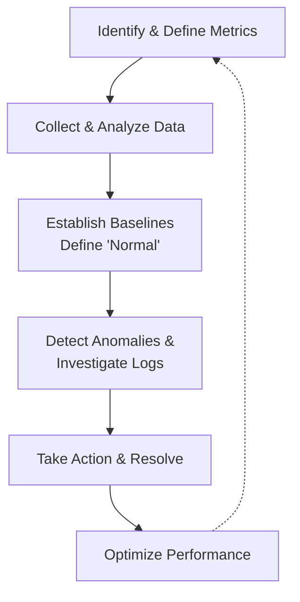

## Monitoring in Microsoft Fabric: Ensuring Data Pipeline Health and Reliability

Monitoring is the practice of collecting and analyzing data about a system's operations to ensure it functions correctly, efficiently, and reliably. It provides the visibility needed to answer critical questions: Is the system healthy? Are processes running on time? Where and why did errors occur? By analyzing historical trends, you can predict issues, optimize performance, and maintain trust in your data.

### Why Monitoring Fabric Activities is Critical

In Fabric, data solutions are built from interconnected **activities** (data pipelines, dataflows, Spark jobs) that have dependencies on one another. A failure or delay in an upstream process (like data ingestion) cascades downstream, affecting transformations, semantic model refreshes, and ultimately, the reports that business users rely on.

Effective monitoring allows you to:
*   **Ensure Reliability:** Guarantee that data arrives in the right place, at the right time, and in the right format.
*   **Maintain Performance:** Identify and eliminate bottlenecks that cause slow-running jobs.
*   **Achieve Resilience:** Quickly detect, diagnose, and remediate errors before they impact users.
*   **Build Trust:** Provide transparency into data pipeline health, fostering confidence in the data being consumed.

### Key Fabric Activities to Monitor

Here are the critical Fabric workloads and what to monitor within them:

| Fabric Activity | What It Is | Key Metrics & What to Monitor |
| :--- | :--- | :--- |
| **Data Pipeline Activity** | A group of activities that perform a coordinated data task (ETL/ELT). | **Success/Failure Status,** **Duration,** **Error Messages,** **Job History** (for trend analysis). Monitor for specific activity failures within a pipeline. |
| **Dataflows** | A low-code tool for data ingestion and transformation using Power Query. | **Start/End Time,** **Status,** **Duration,** **Table Load Details.** Drill into specific query steps to find transformation errors. |
| **Semantic Model Refreshes** | The process of updating a Power BI dataset with new data from its source. | **Refresh Status,** **Duration,** **Number of Retries** (indicates transient issues), **CPU/Memory Usage.** |
| **Spark Jobs, Notebooks & Lakehouses** | Code-first interface for large-scale data processing and transformation using Apache Spark. | **Job Progress,** **Task Execution Metrics,** **Executor Resource Usage (CPU/Memory),** **Spark Driver Logs** (for detailed error info). |
| **Eventstreams** | A perpetually running process for ingesting and transforming real-time streaming event data. | **Ingestion Latency,** **Throughput (events/sec),** **Error Rate,** **Destination Status** (e.g., success of writing to a lakehouse). |

### From Monitoring to Action: Best Practices Framework

Simply collecting data is not enough. You must act on it. Follow this cyclical best practice framework:

**1. Identify What to Monitor**
*   Start with the critical business-level SLA: "Does the sales dashboard have fresh data by 8 AM every day?"
*   Translate that into technical metrics: Therefore, the pipeline must finish by 7:30 AM, the semantic model refresh must finish by 7:45 AM, etc.
*   Track key technical metrics for each activity: **Status**, **Duration**, **Resource Consumption**.

**2. Collect and Analyze Data Continuously**
*   Use **Monitor Hub** as your central dashboard for a live view across all Fabric items.
*   Don't just check for failures. Analyze trends over time. Is a pipeline slowly getting slower? This indicates a performance degradation that will eventually become a failure.

**3. Establish Baselines and Review Logs**
*   **Baseline:** Determine what "normal" looks like for each process (e.g., "This pipeline normally runs in 10 minutes").
*   **Logs:** When a metric deviates from its baseline, immediately drill into the execution logs and error messages. This is your primary source for diagnostic information.

**4. Take Corrective and Proactive Action**
*   **React:** Use the insights from logs to fix the root cause of failures.
*   **Automate:** Use **Fabric Activator** to set up alerts for failures or to automatically retry jobs that fail due to transient issues (e.g., a brief network timeout).
*   **Notify:** Implement alerting to notify teams (via Teams, email) of critical issues so they can be addressed before users are affected.

**5. Continuously Optimize Performance**
*   Use monitoring data to identify performance bottlenecks. For example:
    *   A Spark job with high memory usage may need to be optimized or allocated more resources.
    *   A dataflow with a slow query might need its logic revised.
    *   A pipeline waiting on a dependency might need to be rescheduled.

By implementing this structured approach to monitoring, you transform your Fabric data platform from a fragile collection of scripts into a robust, reliable, and trusted enterprise asset.
